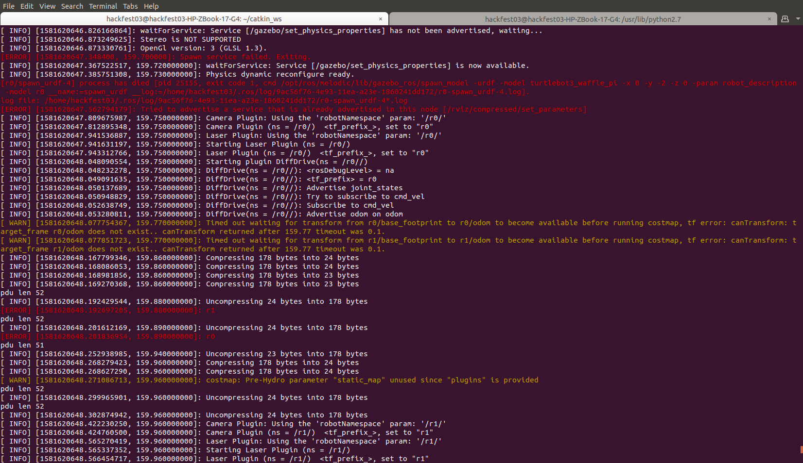
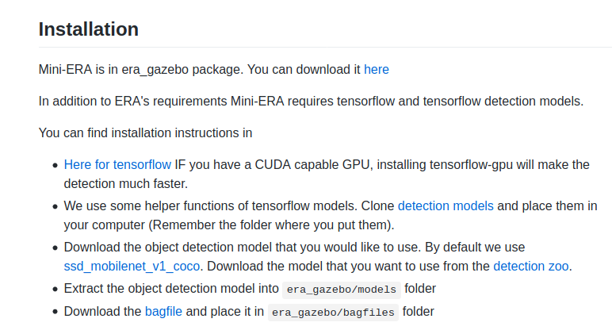

# Errors 02/14/2020

## Problems
There seem to appear some errors on the terminal when you try to execute the following commands:
```
roslaunch era_gazebo era_melodic.launch
```
```
roslaunch era_gazebo era_playback_melodic.launch bag_name:=/home/hackfest03/catkin_ws/src/era_gazebo/bagfiles/cmd_vel_r0.bag
```

Example 1:


Example 2:


Example 3:


## Files needed
* On the [Mini-ERA (Standalone version)](https://github.com/IBM/era/wiki/Mini-ERA-(STANDALONE)), when you try to download the video file sample, an IBM user restrictrion appears:


* On the [Mini-ERA (ROS version0](https://github.com/IBM/era/wiki/Mini-ERA-(ROS-VERSION)), when you try to download the bag file to reproduce the environment, you find the same IBM user restriction:

