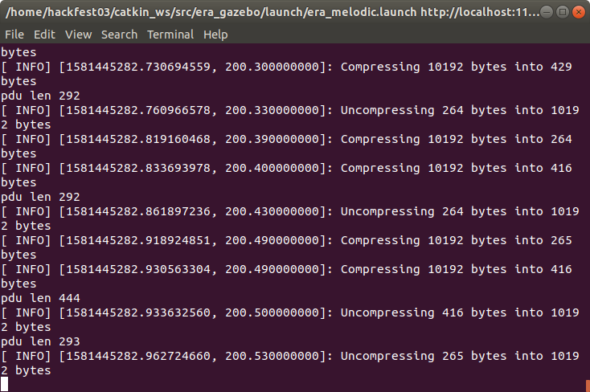
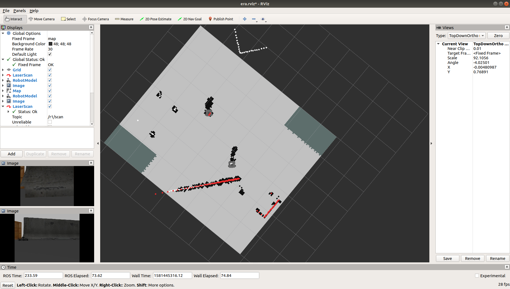
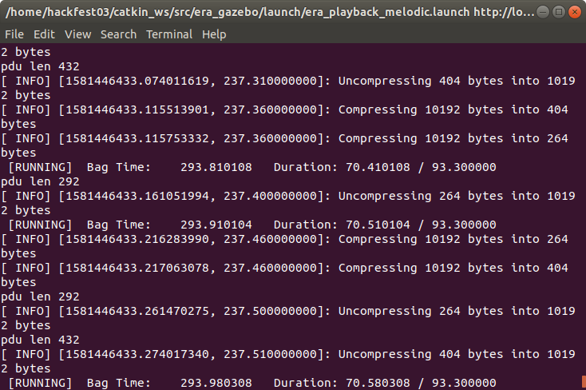
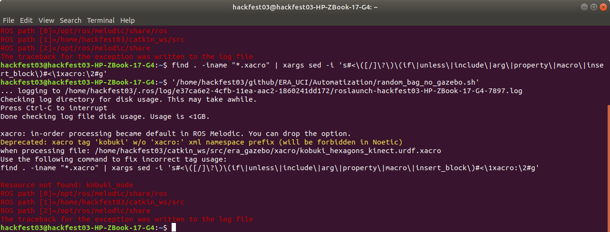
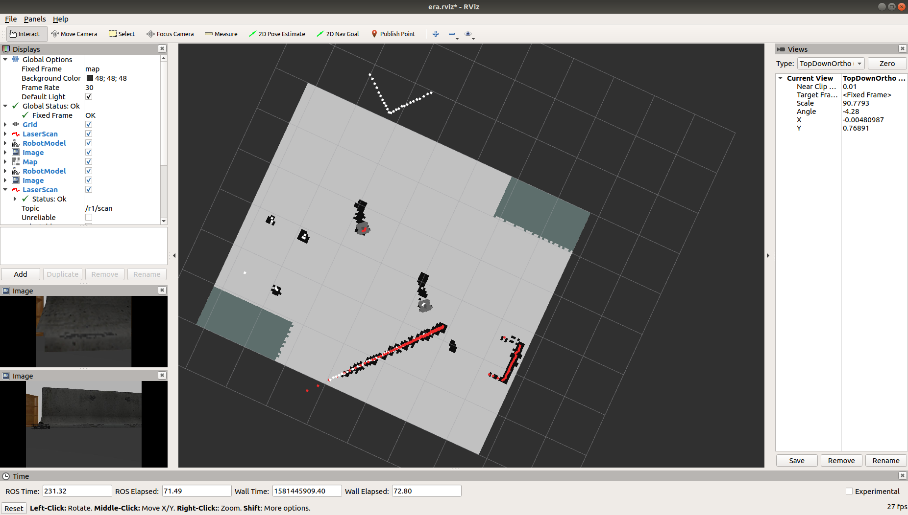
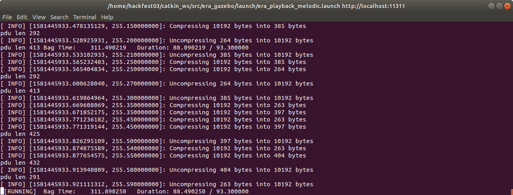
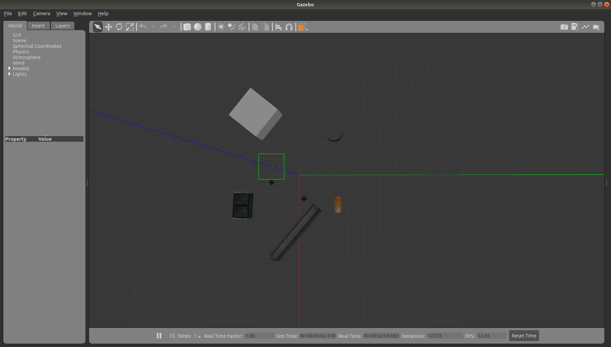
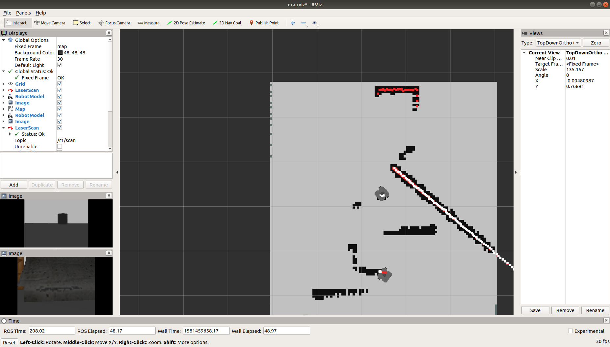

# What does ERA exactly do?
Here we will explain more profoundly, what the main instructions from the [ERA GitHub](https://github.com/IBM/era) exactly do and what are the main components of the software. 

## Basic steps

If you observe the code of the GitHub repository, you will find out that there is a folder called **Mini-ERA**. Then what is the difference between ERA and Mini-ERA? 

ERA v2 is basically a meta repository. The real code of ERA is found in https://github.com/IBM/era_gazebo and https://github.com/IBM/dsrc. The DSRC one is the GNUradio code. 

In general, it creates an environemnt where you have two vehicles, each one builds and transmits an occupancy map based on the laser data. When a vehicle receives a map from another vehicle, it merges it with the local one to obtain a bigger, richer map. As we were informed, the next version of ERA (they call it ERA v3) will include object detection with CNN, and possible some additional computer vision methods. 

Also, this next version will be basically a merge of Mini-ERA and ERA v2! 

Why? 

Well because Mini-ERA consists of a DNN based object detection and labeled occupancy grid creation and that is what the third version will include on the future. You can find Mini-ERA in era_gazebo package.


Finally, to start explaing ERA in general, it is better to execute the most basic commands to see what prompts and all the tools that are involved in the software, but before that, for every terminal that we open involved on ROS commands, we must type:

> ```
> source /home/*your_username*/catkin_ws/devel/setup.bash
> ```

Because typing this commands on every terminal that we open can sometimes become tedious, on the folder [Automatization](../Automatization), you will find bash scripts that execute the former commands and makes the task easy and comfortable. 

**Remember!** You have to give permissions (sudo chmod +x <name_of_the_file>) to be able to execute it!


## Content
* DSRC & GNU Radio
* Basic Interaction
* Bag File
* Move the robot by yourself!
* Troubleshooting

## DSRC & GNU Radio
ERA includes components implemented in GNU Radio (gr-ros_interface, gr-foo and gr-ieee802-11) that have to be built and installed separately as explained next. The **gr-ieee802-11** project is the GNU Radio-based implementation of an IEEE 802.11p transceiver while the **gr-foo** project includes a collection of custom blocks that are used by gr-ieee802-11. The **gr-ros_interface** project implements the interface to connect together the ROS and GNU Radio "worlds".

## Basic Interaction

  #### Command
  
> ```
> roslaunch era_gazebo era_melodic.launch
> ```

  #### Output

By watching the output of the program when it is killed, we can observe the next modules used on the software ERA (wherever you see r1, the output had the same for r0, so we ommited that part):

```
[rviz-23] killing on exit
[r1/map_fuser-22] killing on exit
[r1/wifi_transceiver-21] killing on exit
[r1/ERAmsgBuilder_node-19] killing on exit
[r1/costmap_node-18] killing on exit
[r1/transform_publisher-17] killing on exit
[r1/ERAmsgInterpreter_node-20] killing on exit
[r1/depthimage_to_laserscan-16] killing on exit
[r1/laserscan_nodelet_manager-15] killing on exit
[r1/robot_state_publisher-14] killing on exit
pdu len 300
[gazebo-2] killing on exit
[rosout-1] killing on exit
[master] killing on exit
```

Also, we observe the exchange of messages between the two turtlebot3s:
<p align="center">
  
</p>


Finally, this is what pops out when we execute the command:
<p align="center">
  
</p>

  #### Modules
  
  
  #### What Can We Do?


## Bag File

 #### Command 1
  
> ```
> roslaunch era_gazebo era_playback_melodic.launch bag_name:=/home/hackfest03/catkin_ws/src/era_gazebo/bagfiles/cmd_vel_r0.bag
> ```

#### Command 2
  
> ```
> roslaunch era_gazebo era_playback_melodic.launch bag_name:=/home/hackfest03/catkin_ws/src/era_gazebo/bagfiles/cmd_vel_r0.bag gui:=false
> ```

#### Command 3
  
> ```
> roslaunch era_gazebo era_playback_melodic.launch bag_name:=/home/hackfest03/catkin_ws/src/era_gazebo/bagfiles/cmd_vel_r0.bag gui:=false prof:=true
> ```


 #### Output

After killing the three commands, we can observe the same following modules (that is because all three of them use the same launch, the only thing that changes is the options to show more or less content):
```
rviz-25] killing on exit
[r1/map_fuser-24] killing on exit
[r1/wifi_transceiver-23] killing on exit
[r1/ERAmsgInterpreter_node-22] killing on exit
[r1/costmap_node-20] killing on exit
[r1/ERAmsgBuilder_node-21] killing on exit
[r1/transform_publisher-19] killing on exit
[r1/depthimage_to_laserscan-18] killing on exit
[r1/laserscan_nodelet_manager-17] killing on exit
[r1/robot_state_publisher-16] killing on exit
[r0/transform_publisher-9] killing on exit
[r0/depthimage_to_laserscan-8] killing on exit
[r1/wifi_transceiver-23] escalating to SIGTERM
[r0/wifi_transceiver-13] escalating to SIGTERM
[gazebo_gui-4] escalating to SIGTERM
[gazebo-3] escalating to SIGTERM
[rosout-1] killing on exit
[master] killing on exit

```

<p align="center">
  
</p>

<p align="center">
  
</p>

<p align="center">
  
</p>

<p align="center">
  
</p>

<p align="center">
  
</p>

<p align="center">
  
</p>

 ### Modules
 
 
 #### What Can We Do?

## Move the robot by yourself!

 #### Command

Open a new terminal for each one of the robots and type: 
> ```
> cd /home/hackfest03/catkin_ws/
> source devel/setup.bash
> roslaunch era_gazebo keyboard_teleop.launch namespace:=<name_of_the_robot>
> ```

In our case, the names of the robots are r0 & r1. The instructions are simple, in order to move the robots, you will need the w a s d x buttons of your keyboard. The difference between usual controllers is that pressing w to move forward increases the speed towards that direction and if we stop pressing it, the movement becomes uniform but that does not mean that the robot will stop until we press the same amount of time on the opposite direction (x). 

 #### Terminal Output
 
Robot starting interface:
<p align="center">
  
</p>

Robot during movement:
<p align="center">
  
</p>

Robot Movement:
 <p align="center">
  
</p>


 #### Modules
 
On the environment in general, they are exactly the same ones as commented before on the case without the bag, but on each one of the robots, we generate the node turtlebot3_teleop_keyboard (turtlebot3_teleop/turtlebot3_teleop_key).
 
Also, observing the terminal output, you can see as a preconfiguration, that it starts an automatic master. What does this mean? That if you alter the configuration, you can control both robots from different computers if they use the same software. As a default, the IP & port default are http://localhost:11311 but we can modify it following the instructions on the [ERA Wiki for 2 computers](https://github.com/IBM/era/wiki/ERA-in-two-computers).

 #### What Can We Do?


## Troubleshooting
After trying to execute the bag file, I had problems because the software was asking for two expected inputs:

In the end, the solution was going to  and modify the era_playback_melodic.launch, where we comment the following two lines of code by adding an ! after the < symbol:
> ```
> <-- arg name="prof" value="$(arg prof)" -->
> <-- arg name="prof_output_filename" value="$(arg prof_output_filename)" -->
> ```
The reason this may have happened, after doing some research about it, it may be due to the change of versions of ROS between Kinectic and Melodic.

